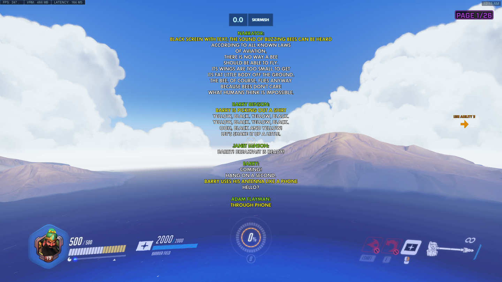

# beemoviescript.ows

script.pdf taken from [scripts.com](https://www.scripts.com/script/bee_movie_313). All credits due to the authors in there.

## How to Read
1. Create a custom game in Overwatch 1.42+
2. Set Gamemode to Skirmish and only toggle on the map Illios
3. Get the script from one of the .ows files on this repository, copy all the text
4. Go to the Settings/Workshop and click the orange paste button
5. Start the game

- Start from script.0.ows
- Use Ultimate (Q) or Ability 2 (E) to go through the pages
- Once you reach the end of a script, copy the contents of the next script and repeat step 4 and 5

Happy reading!
